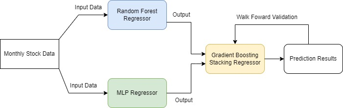

# Random Forest Stock Selection and Portfolio Optimization

## Project Overview

This project utilizes ensemble machine learning models, specifically Random Forest and Multi-layer Perceptron regressors, stacked together with a Gradient Boosting regressor, to predict stock returns. The aim is to capture non-linear relationships between stock features and returns. The project includes the selection of top-performing stocks for portfolio optimization using Mean Variance Optimization and Hierarchical Risk Parity methods.

Each month, top ranked stocks based on next month expected monthly returns are generated, used as vector inputs for the portfolio, optimized using Mean Variance Optimization and Hierarchical Risk Parity from 2014 to 2019. 

## Model Configuration

### General Analysis

- Number of Stocks: Choose the number of stocks in the portfolio (Slider: 25 to 250)
- Historical Years: Choose the number of historical years for prediction (Slider: 1 to 3)

### Project Description

- [Project Paper](https://www.tandfonline.com/doi/epdf/10.1080/1331677X.2021.1875865?needAccess=true)
- Based on the paper: 'A novel stock selection and portfolio optimization model based on random forest and hierarchical risk parity' by Qian, Y., Zhang, Y., & Zhang, Y. (2021).

## Feature Engineering

- Engineered features include:
  1. Simple Moving Average (SMA)
  2. Short Term Reversal
  3. Long Term Reversal
  4. Stock Momentum
  5. Market Beta
  6. Turnover Volatility
  7. Total Return Volatility
  8. VWAP
  9. Log Returns
  10. Volatility (30, 60, 252)
  11. Relative Strength Index (RSI)
  12. Commodity Channel Index (CCI)
  13. Bollinger Bands Width
  14. Williams %R

## Model Architecture

The ensemble machine learning model is built with Random Forest Regressor and Multi-layer Perceptron regressor, stacked together with a Gradient Boosting Regressor. The model is optimized using GridSearchCV and Walk Forward Validation Technique.

## Performance Results

